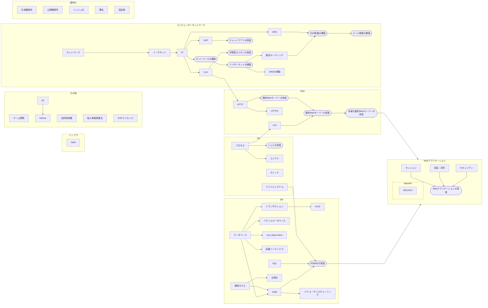

```mermaid
%%{ init: { 'flowchart': { 'curve': 'linear' } } }%%
flowchart LR
    subgraph インフラ
        AWS
    end

    subgraph その他
        チーム開発
        知的財産権
        個人情報保護法
        OSSライセンス
        Git --> GitHub
    end

    subgraph Web
        CGI --> 動的Webサーバー([動的Webサーバーの実装])
        HTTP --> HTTPS
        HTTP --> 静的Webサーバー([静的Webサーバーの実装])
        静的Webサーバー --> 動的Webサーバー
        動的Webサーバー --> 多重化動的Webサーバー([多重化動的Webサーバーの実装])
    end

    subgraph コンピューターネットワーク
        IP --> TCP
        IP --> UDP
        ネットワークの構築 --> インターネットの構築([インターネットの構築])
        UDP --> チャットアプリ([チャットアプリの実装])
        IP --> ネットワークの構築([ネットワークの構築])
        TCP --> ヌメロンの実装([対戦型ヌメロンの実装])
        ネットワーク --> イーサネット --> IP
        インターネットの構築 --> 動的ルーティング --> DNS基盤の構築
        IP --> DNS --> DNS基盤の構築([DNS基盤の構築])
    %%        ファイアウォール --> DMZの構築([DMZの構築])
        インターネットの構築 --> DMZの構築
        DNS基盤の構築 --> メール基盤の構築([メール基盤の構築])
    %%            ファイアウォール --> ネットワークの構築([ネットワークの構築])
    %%            DMZ --> ネットワークの構築([ネットワークの構築])
    %%            サブネット --> ネットワークの構築([ネットワークの構築])
        TCP --> HTTP
    end

    subgraph OS
        プロセス --> CGI
        プロセス --> シェル([シェルの実装])
        プロセス --> コンテナ
        スレッド
        ファイルシステム
    end

    subgraph 暗号化
        共通鍵暗号
        公開鍵暗号
        ハッシュ化
        署名
        認証局
    end

    subgraph DB
        データベース --> RDB
        データベース --> ベクトルデータベース
        データベース --> Key-Value-Store
        データベース --> 転置インデックス
        データベース --> トランザクション
        トランザクション --> ACID
        関係モデル --> RDB
        関係モデル --> 正規化

        RDB --> RDBMS
        RDB --> パフォーマンスチューニング
        SQL --> RDBMS
        ファイルシステム --> RDBMS([RDBMSの実装])
    end

    RDBMS --> Webアプリケーション
    多重化動的Webサーバー --> Webアプリケーション

    subgraph Webアプリケーション
        direction TB
        セッション
        認証認可["認証・認可"]
        セキュリティ
        subgraph WebAPI
            RESTAPI
        end

        セッション --> Webアプリケーションの実装([Webアプリケーションの実装])
        認証認可 --> Webアプリケーションの実装([Webアプリケーションの実装])
        セキュリティ --> Webアプリケーションの実装([Webアプリケーションの実装])
    end
```